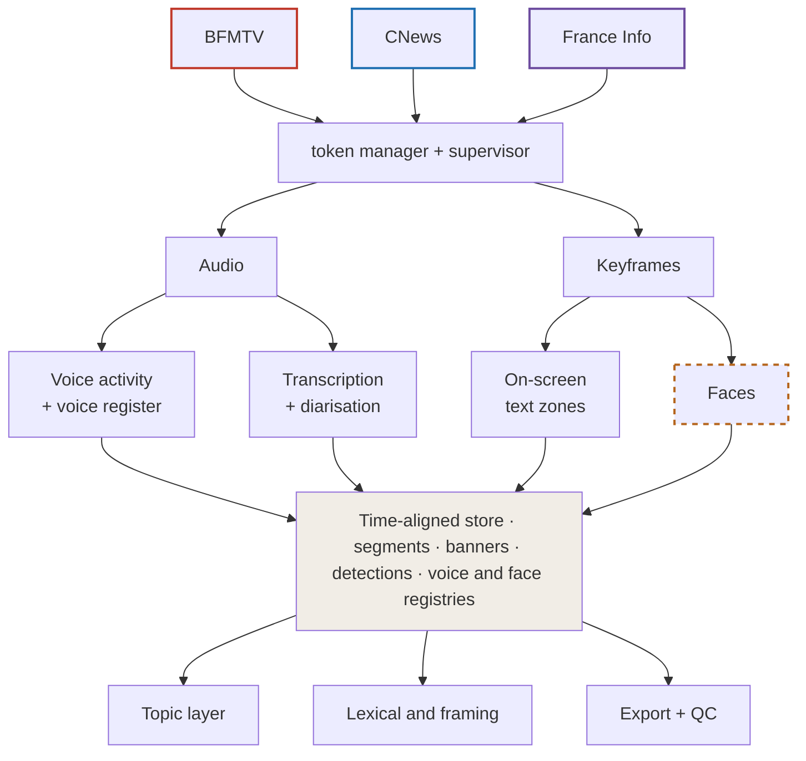

# Observatoire Laudisi

Laudisi watches French rolling news. Since March 2026 it has been recording, transcribing
and analysing BFMTV, CNews and France Info without interruption, putting the spoken word,
who is speaking, and the text on screen onto one shared timeline.

The idea is to look at continuous news as it actually goes out, minute by minute, rather
than through the summaries and transcripts that come afterwards. So far it has been useful
for three questions: how much of the agenda the channels share, where they diverge once the
topic is held constant, and how the day is structured hour by hour.

## How it fits together

Faces are held in the database but stay out of anything exported.

## What's here

Just this description and the diagram. The code, the models and the recordings aren't in
this repository.

It was presented for the first time at the Computational Humanities Research Group seminar
at King's College London, on 9 September 2026.

## Get in touch

If you work on something adjacent, or you're curious about the data, I'd be glad to hear
from you.

## Citing it

Metadata is in [`CITATION.cff`](CITATION.cff). In short:

> de Boisvilliers, Y. (2026). *Observatoire Laudisi: a continuous multimodal observatory of
> French rolling-news television.* https://github.com/Yanndebois974/laudisi_observatory

---

## En bref

Laudisi enregistre, transcrit et analyse en continu depuis mars 2026 les trois chaînes
françaises d'information en continu — BFMTV, CNews et France Info. La parole, les locuteurs
et les textes affichés à l'écran sont replacés sur une même ligne de temps, de façon à
observer l'information en continu telle qu'elle est diffusée.

Ce dépôt ne contient que cette présentation et le schéma ; ni le code, ni les modèles, ni
les enregistrements n'y figurent.

© 2026 Yann de Boisvilliers — voir [`LICENSE`](LICENSE).

---

## Contact

[✉️ yann.deboisvilliers@psl.eu](mailto:yann.deboisvilliers@psl.eu)
